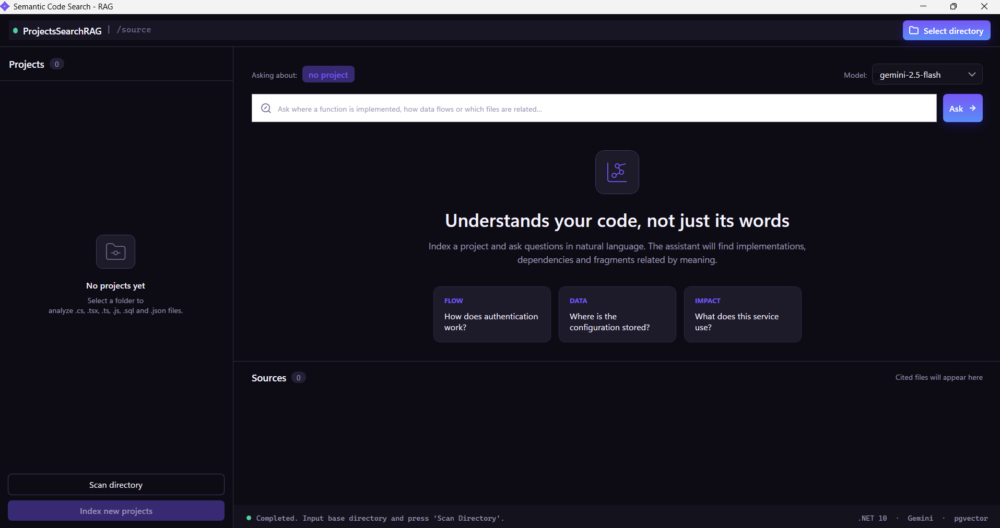
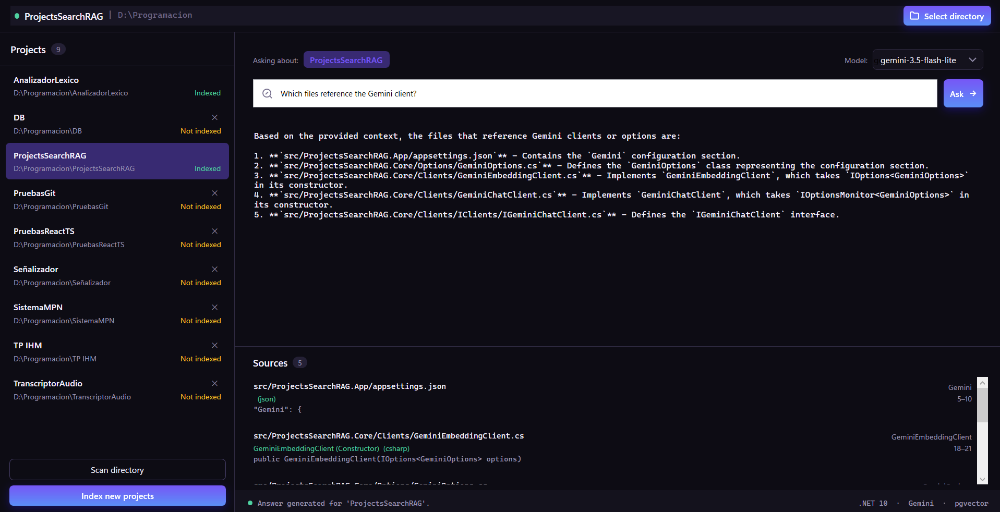
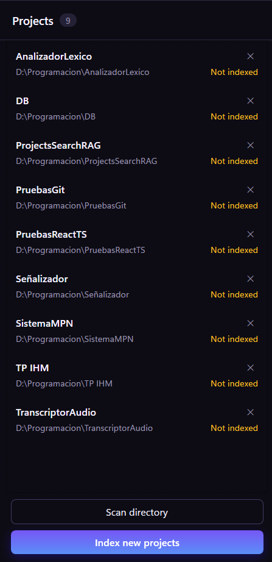

# ProjectsSearchRAG

Aplicación de escritorio **WPF (.NET 10)** que permite buscar y consultar código fuente de proyectos con **RAG** (Retrieval-Augmented Generation). Escanea proyectos, genera embeddings con **Gemini** y los almacena en **PostgreSQL** con la extensión **pgvector** para búsqueda semántica.

## Características

- Escaneo e indexación de proyectos (solo archivos `.cs`, `.tsx`, `.ts`, `.js`, `.sql` y `.json`; por el momento no se agregan más extensiones automáticamente).
- Vectorización de chunks de código con `gemini-embedding-001` (dimensión 768).
- Búsqueda semántica por similitud coseno vía `pgvector`.
- Chat con contexto recuperado usando `gemini-2.5-flash`.
- Migraciones de base de datos aplicadas automáticamente al iniciar la app.

## Imágenes del proyecto

### 1. Ventana principal



### 2. Respuesta con fuentes citadas



### 3. Proyectos indexados



## Requisitos

- [.NET SDK 10](https://dotnet.microsoft.com/download) (o superior).
- [PostgreSQL](https://www.postgresql.org/download/) con la extensión [pgvector](https://github.com/pgvector/pgvector) instalada.
- Una clave de API de [Google Gemini](https://aistudio.google.com/apikey).

## Configuración

1. Crea tu archivo `.env` copiando la plantilla:

   ```bash
   copy src\ProjectsSearchRAG.App\.env.example src\ProjectsSearchRAG.App\.env
   ```

2. Completa `.env` con tus credenciales:

   ```
   ConnectionStrings__DefaultConnection=Host=localhost;Port=5432;Database={Nombre_BD};Username={Nombre};Password={Contraseña}
   Gemini__ApiKey=TU_CLAVE_API_GEMINI
   Gemini__EmbeddingModel=gemini-embedding-001
   Gemini__EmbeddingDimension=768
   Gemini__ChatModel=gemini-2.5-flash
   ```

   > El archivo `.env` está ignorado por git y **nunca se sube** al repositorio.

3. Aplica la migración inicial (opcional: la app la aplica sola al arrancar):

   ```bash
   dotnet tool restore
   dotnet ef database update --project src/ProjectsSearchRAG.Data\ProjectsSearchRAG.Data.csproj
   ```

## Compilar y ejecutar

```bash
dotnet restore
dotnet run --project src\ProjectsSearchRAG.App
```

## Ejecutar pruebas

```bash
dotnet test
```

## Estructura del proyecto

```
src/
  ProjectsSearchRAG.App            # Aplicación WPF (Vista, ViewModels, Resources)
  ProjectsSearchRAG.Core           # Lógica de dominio: escaneo, chunking, embeddings, RAG
  ProjectsSearchRAG.Data           # EF Core, contexto, modelos y repositorios (pgvector)
  ProjectsSearchRAG.Infrastructure # Configuración de inyección de dependencias
tests/
  ProjectsSearchRAG.Tests          # Pruebas unitarias (xUnit)
```

## Tecnologías

- .NET 10 / WPF (MVVM con CommunityToolkit.Mvvm)
- Google.GenAI (Gemini: embeddings + chat)
- EF Core + Npgsql + pgvector
- xUnit